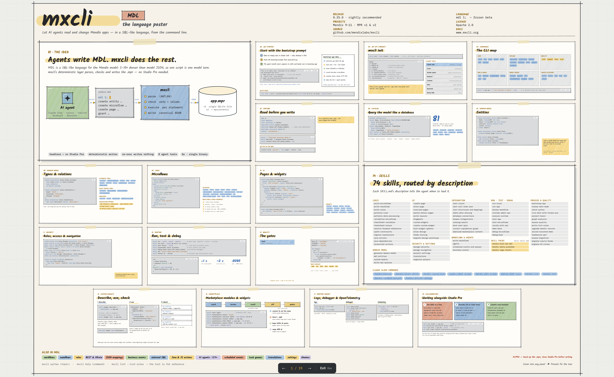

# The Language Poster

All of mxcli and MDL on one page: the idea, getting started, the CLI map, exploring and querying a project, domain models, microflows, pages, security, running and testing, quality gates, skills, custom widgets, the Marketplace, runtime insight, and working alongside Studio Pro.

**[Open the interactive poster](../poster/mxcli-language-poster.html)** -- zoom into any panel, or step through it as a 19-panel tour.

